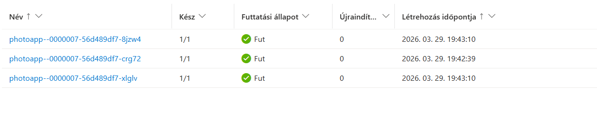
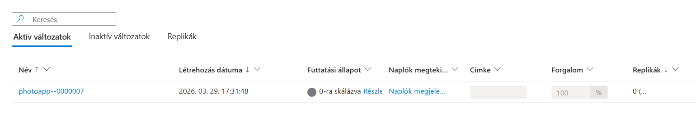
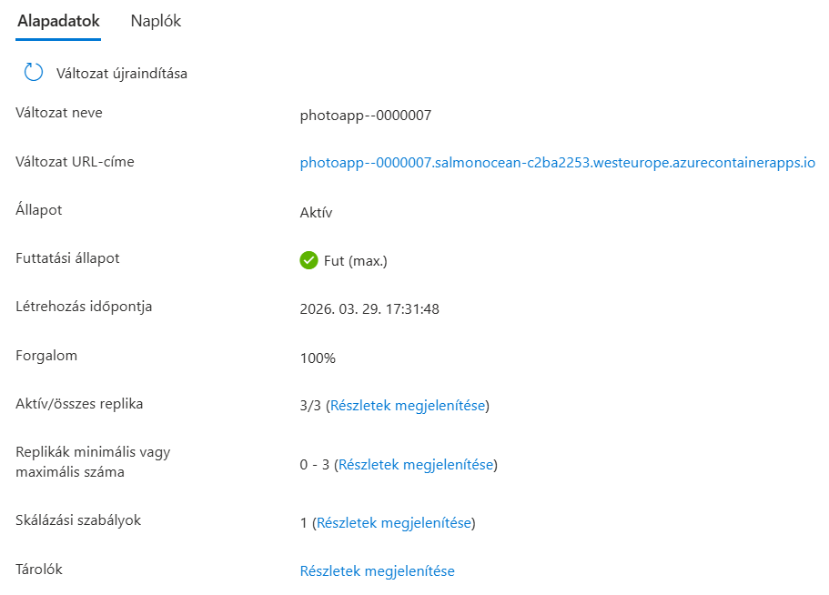
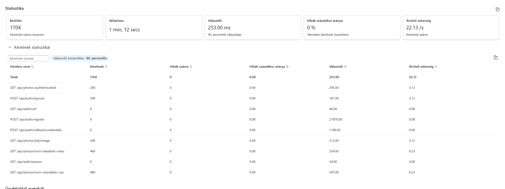

# PhotoApp

A simple photo management web application built with Next.js (App Router), Prisma, and PostgreSQL.

## Chosen Architecture

The project follows a layered architecture:

1. **UI Layer**
- `src/components/PhotoAlbum.tsx` is the main client-side interface.
- It handles login/register, upload, listing, sorting, preview, and delete actions.

2. **API Layer**
- Route handlers are in `src/app/api/**/route.ts`.
- Endpoints expose REST-style operations for auth and photos:
  - `/api/auth/register`, `/api/auth/[...nextauth]`
  - `/api/photos`, `/api/photos/[id]`, `/api/photos/[id]/image`

3. **Service Layer**
- `src/server/services/photoService.ts` contains business logic:
  - input validation (photo name),
  - storage key generation,
  - orchestration between file storage and database operations.

4. **Repository/Data Layer**
- `src/server/repositories/photoRepository.ts` encapsulates Prisma database queries.
- `prisma/schema.prisma` defines `User` and `Photo` models and relevant indexes.

5. **Storage Abstraction**
- `src/server/storage/storage.ts` selects the storage backend by environment variable.
- Implementations:
  - local filesystem (`localFsStorage.ts`) for local/dev use,
  - Azure Blob Storage (`azureBlobStorage.ts`) for cloud use.

6. **Authentication**
- Auth.js (`next-auth`) with credentials provider configured in `src/auth.ts`.
- Protected photo operations resolve user identity from the Auth.js session in route handlers.

## Cloud Scalability

If deployed to a cloud provider, the architecture scales as follows:

1. **Horizontally Scalable App Tier**
- Application instances are mostly stateless (session is stored in signed cookie).
- Multiple app replicas can run behind a load balancer.

2. **Scalable Object Storage**
- Switching to `STORAGE_BACKEND=azure` moves image files to Azure Blob Storage.
- This avoids local disk dependency and supports multi-instance deployments.

3. **Scalable Database Tier**
- Metadata is stored in PostgreSQL and can be hosted on a managed service.
- Existing Prisma schema indexes support common sorting and filtering patterns.

4. **Production Deployment Pattern**
- Containerize app and run with orchestrator (e.g., AKS/Kubernetes, App Service, ECS).
- Use managed PostgreSQL + Blob Storage + shared `AUTH_SECRET`.
- Run Prisma migrations in CI/CD or as a one-off job.

## Notes for Better Scale

- Local filesystem backend (`STORAGE_BACKEND=local`) is not suitable for multi-replica production.
- Current API/image responses use `Cache-Control: no-store`; enabling CDN-friendly caching headers for image delivery would improve performance under higher traffic.
- Recommended additions for larger scale:
  - CDN in front of image content,
  - rate limiting on auth/upload endpoints,
  - centralized logging and monitoring.

## Migration Details
### Environment variables

- `DATABASE_URL`: PostgreSQL connection string.
  In Docker Compose this is set in `compose.yml` (`postgresql://photoapp:photoapp@db:5432/photoapp`).
  The `.env` value is only a local override for non-compose runs.
- `AUTH_SECRET`: high-entropy secret used by Auth.js to protect/encrypt session and token data.
- `STORAGE_BACKEND`: `local` or `azure`. (Defaults to local)
- `UPLOAD_DIR`: local filesystem upload path (used only when `STORAGE_BACKEND=local`).
- `AZURE_STORAGE_CONNECTION_STRING`: required when `STORAGE_BACKEND=azure`.
- `AZURE_STORAGE_CONTAINER`: required when `STORAGE_BACKEND=azure`.

### Storage backend

The app uses a storage abstraction in `src/server/storage`:

- `LocalFsStorage`: stores files on local disk.
- `AzureBlobStorage`: stores files in Azure Blob Storage.

Backend selection is automatic via `STORAGE_BACKEND`.

### Azure deployment notes

- Set `DATABASE_URL` to your Azure PostgreSQL connection string.
- Set `STORAGE_BACKEND=azure` and provide Azure Blob variables.
- Run migrations during deploy: `npx prisma migrate deploy`.

## Deployed Azure Resources (Bird's-Eye View)

The application is deployed as a small-cost Azure setup using mostly existing resources in a single Azure resource group:

- **Container Registry** (Azure Container Registry)
  - Stores the built `photoapp` container image.
- **Container Apps Environment** (Azure Container Apps)
  - Hosts shared infrastructure for Container Apps revisions.
- **Container App**
  - Runs the Next.js application publicly over HTTPS.
  - Uses environment variables/secrets for database, storage, and Auth.js configuration.
- **PostgreSQL**: Flexible Server + application database
  - Stores application metadata (users, photo metadata, relations).
  - Prisma migrations are applied with `npx prisma migrate deploy`.
- **Blob Storage**: Storage account + blob container
  - Stores uploaded image binaries.
  - Selected via `STORAGE_BACKEND=azure`.
- **Log Analytics Workspace**
  - Receives Container Apps logs/diagnostics for monitoring and troubleshooting.

### Resource Flow

1. User requests arrive at the Container App.
2. Auth/session and API logic run in the app container.
3. Photo files are read/written in Azure Blob Storage.
4. Structured metadata is read/written in Azure Database for PostgreSQL.
5. Container/runtime logs are forwarded to Log Analytics.
---

# Azure Container Apps Auto-Scaling and Load Testing Report

## 1. Auto-scaling Configuration (PaaS: Azure Container Apps)

### Environment

-   Resource Group: photoapp-rg
-   Application: photoapp
-   Region: West Europe
-   Public URL:
    https://photoapp.salmonocean-c2ba2253.westeurope.azurecontainerapps.io/

### Architecture

The application is deployed using Azure Container Apps, which provides a
serverless container hosting platform with built-in autoscaling powered
by KEDA (Kubernetes-based Event Driven Autoscaling).

### Scaling Configuration

-   Minimum replicas: 0
-   Maximum replicas: 3
-   Scaling rule: HTTP-based scaling
-   Concurrent requests threshold: 3
-   Cooldown (idle time): 300 seconds
-   Polling interval: 30 seconds

### Scaling Behavior

-   The application scales out when concurrent HTTP requests exceed 3
    per replica.
-   The system scales back when traffic decreases, potentially reaching
    0 replicas.
-   Scaling decisions are based on concurrency rather than request rate.

------------------------------------------------------------------------

## 2. Load Testing Setup

### Tooling

-   Azure Load Testing
-   Apache JMeter (.jmx test plan)

### Test Configuration

-   Threads (users): 6
-   Ramp-up: 2 seconds
-   Loop count: 10

### Test Plan

The test plan simulates concurrent users sending HTTP requests to the
deployed application endpoint.

JMX file used: photoapp-azure-stress.jmx

------------------------------------------------------------------------

## 3. Results Summary

### Key Metrics

-   Total requests: 1704
-   Test duration: \~72 seconds
-   Average response time (P90): \~253 ms
-   Error rate: 0%
-   Throughput: \~22 requests/sec

### Observations

-   The system handled all requests successfully (0% errors).
-   Response times remained stable under load.
-   Multiple API endpoints were exercised during the test.

------------------------------------------------------------------------

## 4. Auto-scaling Behavior

### Scale-out

-   Initial state: 0 replica
-   Under load: scaled up to 2--3 replicas
-   Trigger: concurrency threshold exceeded

### Scale-in

-   After test completion:
    -   replicas decreased gradually
    -   eventually returned to minimum (0)

### Evidence
Scale Out:

Scale In:

Summary:

Test Results from TestRun_3/29/2026_7:42:07 PM:

------------------------------------------------------------------------

## 5. Key Findings

### Scaling Characteristics

-   Autoscaling is not instantaneous (\~30--60s delay observed)
-   Scaling is driven by concurrent requests, not request/sec
-   Threshold tuning is critical

### Performance Insights

-   The application maintained low latency under moderate load
-   No errors occurred, indicating stable backend behavior (Had some difficulties configuring the jmx file correctly for it to handle csr tokens correctly and register different users with different emails)
- Highest response times were observed on auth related endpoints.
------------------------------------------------------------------------

## 6. Conclusion

The Azure Container Apps platform successfully demonstrated automatic
scaling behavior under load. The system efficiently scaled out to handle
increased demand and scaled back down when load decreased, confirming
proper autoscaling configuration and behavior.

